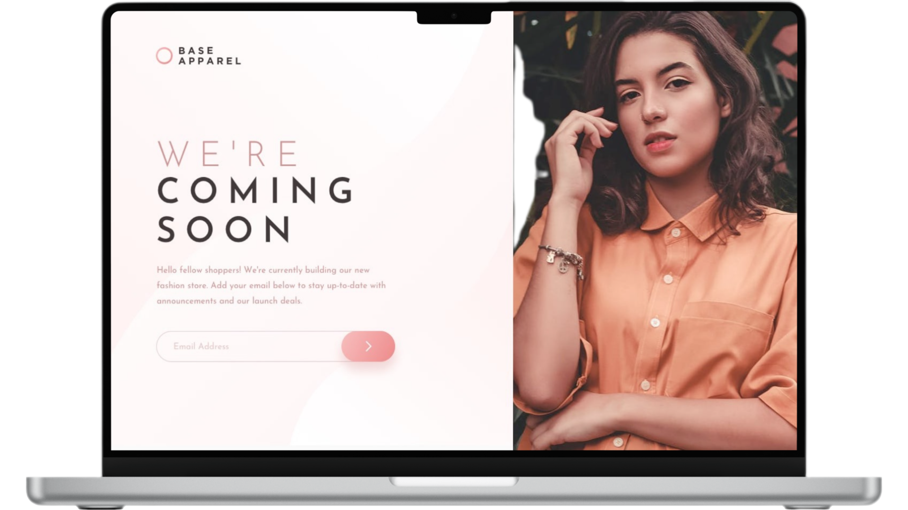

# Base Apparel - Single Page Application

<figure>
    
</figure>

## 📝 **Sobre o Projeto**

    Base Apparel é uma Single Page Application que combina design moderno, funcionalidade e eficiência. Seguindo o conceito Mobile First, a página é totalmente responsiva, adaptando-se a qualquer dispositivo. Inclui recursos como exibição dinâmica de imagens conforme a largura da tela e validação inteligente do campo de e-mail, proporcionando uma experiência prática e intuitiva para o usuário.

[Demo do Projeto](https://base-apparel-walacedev.netlify.app/) 

## 🛠️ **Tecnologias Utilizadas**

- **HTML5** para a estrutura do conteúdo.
- **CSS3** para estilização e design responsivo.
- **JavaScript** para funcionalidades dinâmicas.
- **Sass** (Syntactically Awesome Stylesheets) para pré-processamento de CSS.

## 🚀 **Recursos Principais**
- **Conceito Mobile First:** O design foi criado priorizando dispositivos móveis, garantindo uma experiência fluida e intuitiva, com adaptação perfeita para telas maiores.
- **Design Responsivo:** A página ajusta-se automaticamente a diferentes tamanhos de tela, proporcionando uma navegação consistente em qualquer dispositivo.
- **Exibição Dinâmica de Imagem:** Uma imagem na página muda automaticamente conforme a largura da tela, garantindo uma visualização otimizada.
- **Validação Inteligente de E-mail:** O campo de e-mail conta com validação dinâmica, assegurando praticidade e eficiência para os usuários.

 

## 📂 **Estrutura do Projeto**

├── src 
│   ├── assets          # Imagens 
│   ├── css             # Arquivo de estilização 
│   ├── js              # Arquivo de JavaScript 
│   └── sass            # Arquivos de pré-processador Sass 
├── .gitattributes      # Configurações de atributos do Git 
├── LICENSE             # Licença MIT 
├── README.md           # Documentação do projeto 
└── index.html          # Arquivo principal HTML do projeto

